# hash-collisions-Sarkoxed
Соколов А.Д. Б20-505

## birthday - поиск коллизий с помощью парадокса дней рождений. 
- 15-35 bits

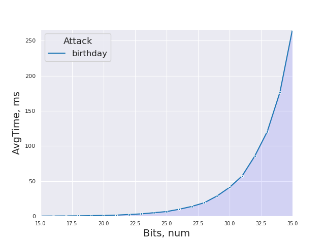

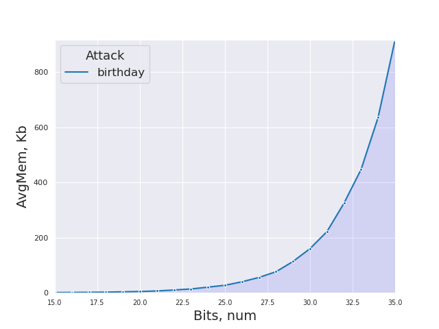 

## pollard - поиск коллизий с помощью метода полларда. 
- При найденной коллизии финальный поиск производится с самого первого значения в треде.

### pollard_short
- 15-35 bits
- За хэш функцию перехода принимается sha256 с обрезанием последних XX битов.

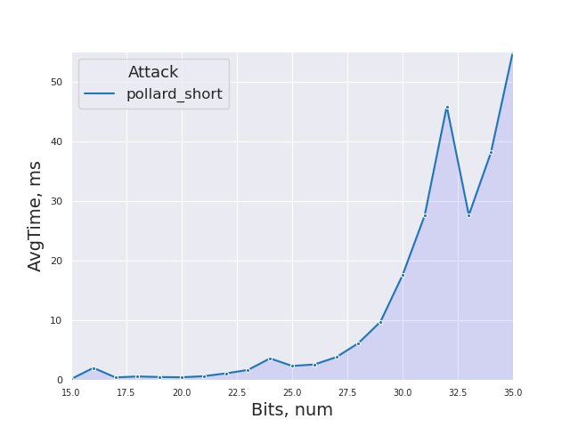

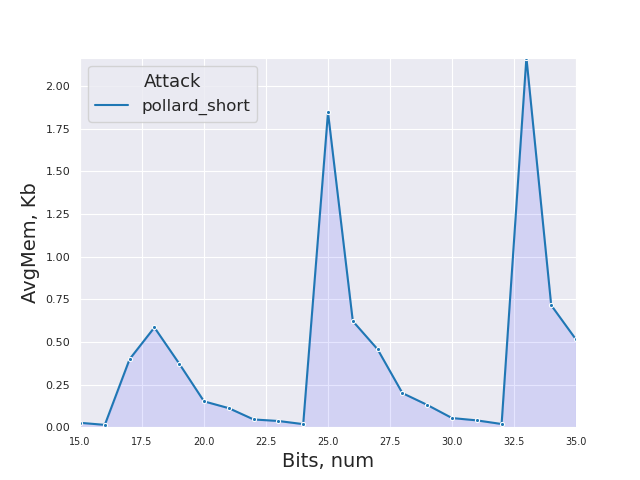 

### pollard_full
- 15-30 bits
- За хэш функцию перехода принимается обычная sha256. 

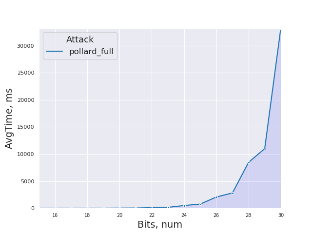

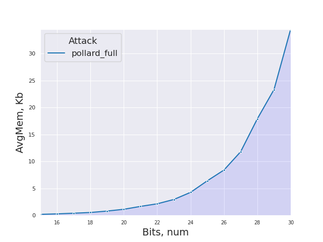 

## pollard_own - поиск коллизий с помощью метода полларда. 
- При найденной коллизии финальный поиск производится с предыдущей отличительной точки.

### pollard_own_short
- 15-35 bits
- За хэш функцию перехода принимается sha256 с обрезанием последних XX битов.

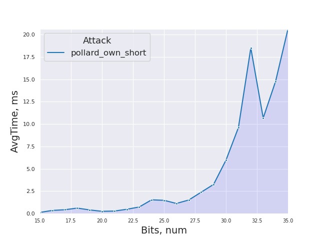

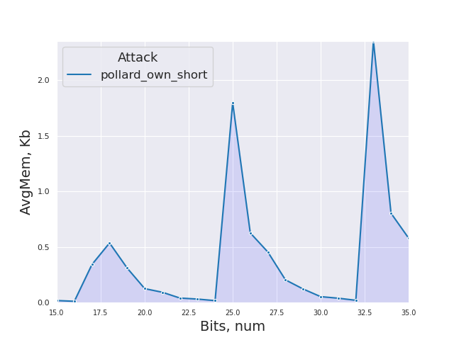 

### pollard_own_full
- 15-30 bits
- За хэш функцию перехода принимается обычная sha256. 

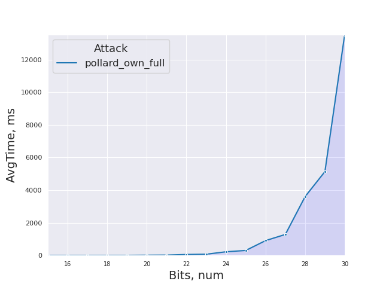

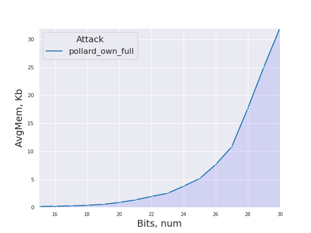 

## Сравнительный график
- По результатам стало ясно, что обе full реализации очень медленные и их можно исключить из финального сравнения.
- 15-20

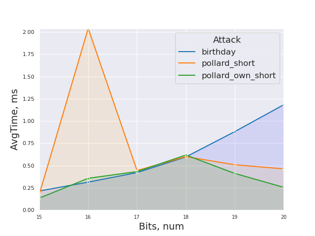

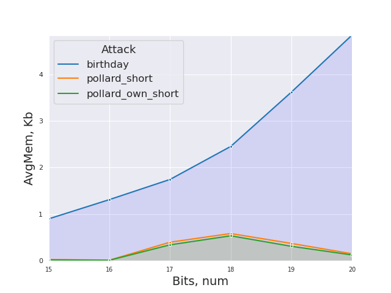 

- 15-35

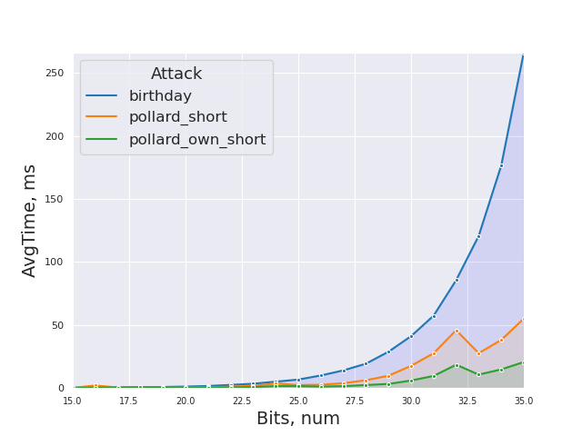

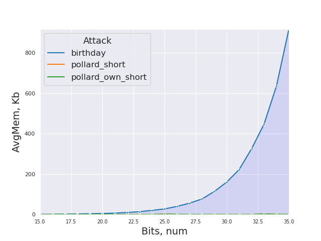 

## Сравнительная таблица результатов

### Время, сек

| nBit | Birthday    | Pollard_short | Pollard_full | Pollard_own_short | Pollard_own_full |
| ---- | ----------- | ------------- | ------------ | ----------------- | ---------------- |
| 15 | 0.00021448 | 0.00018073 | 0.000866605 | 0.000134385 | 0.000543945 |
| 16 | 0.00031372 | 0.002040615 | 0.00246835 | 0.00035643 | 0.00117053 |
| 17 | 0.000420495 | 0.000443775 | 0.00338825 | 0.00043216 | 0.00152272 |
| 18 | 0.000596385 | 0.000600055 | 0.008548595 | 0.00061771 | 0.003820095 |
| 19 | 0.000880275 | 0.00050854 | 0.012575105 | 0.00041143 | 0.00529085 |
| 20 | 0.001181325 | 0.00046277 | 0.033359505 | 0.000255825 | 0.013620695 |
| 21 | 0.001639775 | 0.000646245 | 0.048660015 | 0.000285795 | 0.02033266 |
| 22 | 0.00250498 | 0.00111667 | 0.12692116 | 0.00048378 | 0.058383555 |
| 23 | 0.003427705 | 0.00169273 | 0.173519455 | 0.000738825 | 0.07499757 |
| 24 | 0.005084705 | 0.0036335 | 0.508407705 | 0.00153953 | 0.223834875 |
| 25 | 0.006719205 | 0.002365995 | 0.776434685 | 0.001485025 | 0.306033455 |
| 26 | 0.00997167 | 0.002610105 | 2.072375035 | 0.00113328 | 0.908244085 |
| 27 | 0.014015595 | 0.00383777 | 2.832002605 | 0.001521555 | 1.28657646 |
| 28 | 0.019317335 | 0.00618394 | 8.47999384 | 0.002394855 | 3.60828206 |
| 29 | 0.02881641 | 0.009773445 | 11.00171224 | 0.003263975 | 5.13779922 |
| 30 | 0.041137185 | 0.017597345 | 33.25302326 | 0.00597997 | 13.541051235 |
| 31 | 0.05739652 | 0.02758133 | none | 0.009603825 | none |
| 32 | 0.0855734 | 0.04588565 | none | 0.01850715 | none |
| 33 | 0.12070868 | 0.027647475 | none | 0.01068204 | none |
| 34 | 0.176522645 | 0.03814851 | none | 0.01478291 | none |
| 35 | 0.266300505 | 0.055123415 | none | 0.020642515 | none |

### Память, байт

| nBit | Birthday    | Pollard_short | Pollard_full | Pollard_own_short | Pollard_own_full |
| ---- | ----------- | ------------- | ------------ | ----------------- | ---------------- |
| 15 | 7376.96 | 211.505 | 1584.45 | 152.125 | 1245.75 |
| 16 | 10753.28 | 111.93 | 2313.43 | 96.9 | 1649.0 |
| 17 | 14296.16 | 3266.025 | 3314.325 | 2803.83 | 2208.875 |
| 18 | 20089.6 | 4788.665 | 4406.605 | 4391.25 | 3082.375 |
| 19 | 29623.36 | 3053.33 | 6578.145 | 2546.37 | 4421.175 |
| 20 | 39637.76 | 1240.76 | 9286.2 | 1028.51 | 7206.96 |
| 21 | 55431.2 | 913.92 | 13666.765 | 762.755 | 10946.46 |
| 22 | 83955.04 | 371.96 | 17595.935 | 336.07 | 15983.58 |
| 23 | 114285.76 | 298.4 | 24199.105 | 259.35 | 20587.95 |
| 24 | 168670.4 | 147.32 | 35020.65 | 145.48 | 30918.99 |
| 25 | 224616.8 | 15113.16 | 52542.63 | 14717.24 | 42080.25 |
| 26 | 327967.52 | 5092.88 | 68909.19 | 5130.84 | 62541.42 |
| 27 | 457145.92 | 3739.52 | 96749.8 | 3725.72 | 88604.58 |
| 28 | 626405.92 | 1637.37 | 146781.285 | 1674.27 | 144811.905 |
| 29 | 930922.4 | 1069.965 | 191276.855 | 1004.85 | 205278.22 |
| 30 | 1313161.12 | 439.605 | 283149.79 | 438.525 | 262392.62 |
| 31 | 1821629.6 | 327.87 | none | 323.865 | none |
| 32 | 2665306.4 | 153.225 | none | 170.25 | none |
| 33 | 3662653.44 | 17742.15 | none | 19278.35 | none |
| 34 | 5207779.04 | 5854.59 | none | 6581.4 | none |
| 35 | 7519842.4 | 4210.47 | none | 4749.95 | none |
