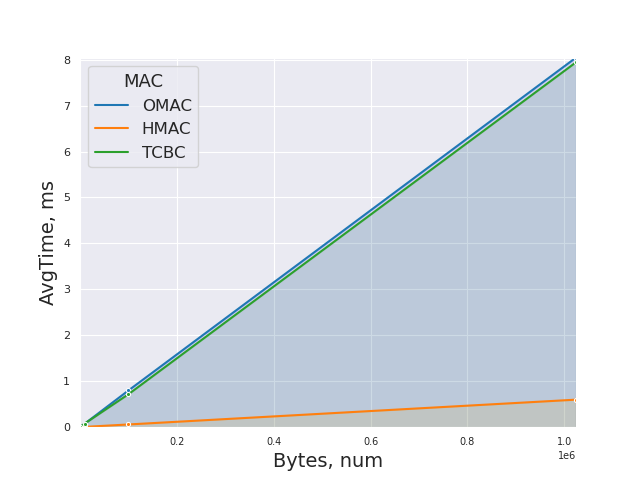
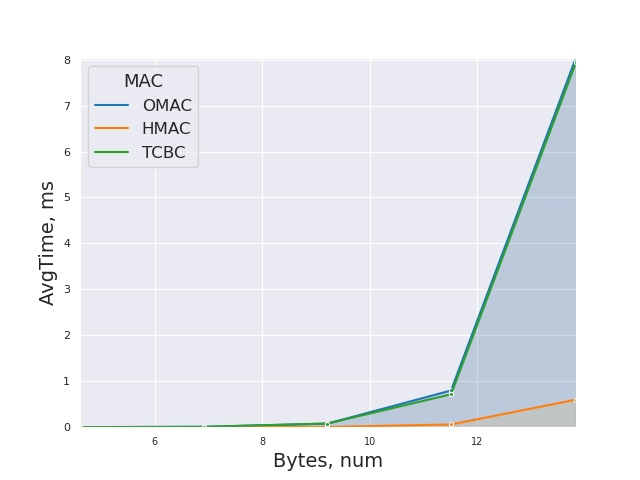

# macs-Sarkoxed"
Соколов А.Д. Б20-505

- Timing

- Timing Log Plot

- OMAC

| Bytes   | AvgTime       |
| ------- | ------------  |
| 100     | 0.0000018750  |
| 1000    | 0.0000089430  |
| 10000   | 0.0000780730  |
| 100000  | 0.0007989310  |
| 1024000 | 0.0080441830  |

- HMAC

| Bytes    | AvgTime       |
| -------  | ------------  |
| 100      | 0.0000000000  |
| 1000     | 0.0000001900  |
| 10000    | 0.0000068780  |
| 100000   | 0.0000596610  |
| 1024000  | 0.0005995770  |

- TCBC

| Bytes    | AvgTime       |
| -------  | ------------  |
| 100      | 0.0000010340  |
| 1000     | 0.0000076300  |
| 10000    | 0.0000804010  |
| 100000   | 0.0007169800  |
| 1024000  | 0.0079424390  |
