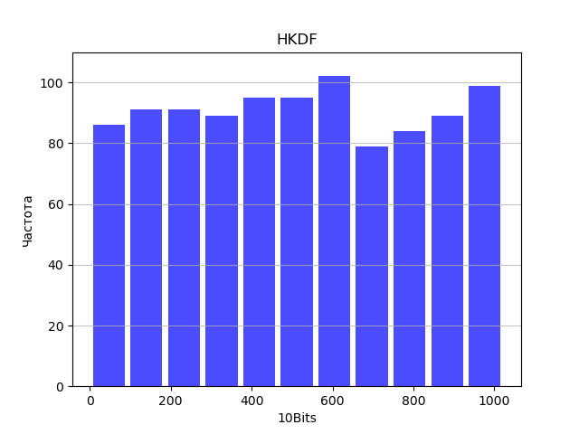

# hdkf-Sarkoxed
Соколов А.Д. Б20-505

## HKDF

### Гистограммы погодных характеристик:

### Cмешаннaя величина

За смешанную величину было принято взять скомбинрованные облачность и озоновй слой, потому что их гистограммы выглядят менее сгруппированно на фоне остальных.

Формула по которой смешивались значения: $(\frac{ozone}{400}+ 3*cloud) * \frac{256}{3.5}$, потому что данная формула нормировала величину в пределах 256

### Гисторамма первых 10 бит 1000 выходных ключей

выглядит равномерно

## PBKDF2

### Гистограмма первых 5 бит 1000 паролей

### Гистограмма первых 10 бит выходных ключей

### PS
В принципе формула была не очень важна потому что энтропия суммы случайных величин точно неубывает, тогда мы можем с той же легкостью взять весь файл с погодными условиями(может выбрать только часы и т.д) и посчитать sha256 от него так как функция в общем инъективная.
